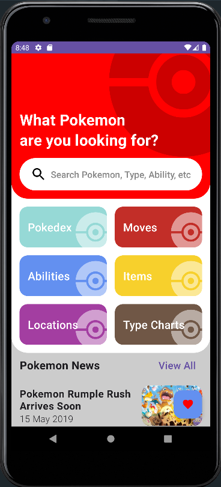
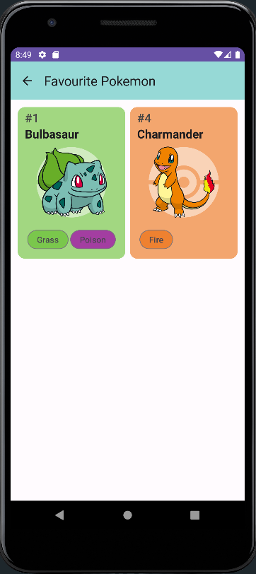
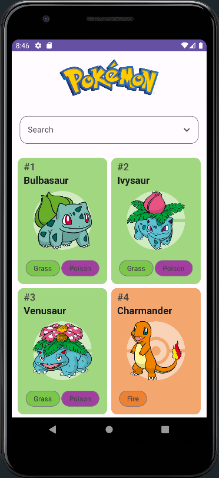
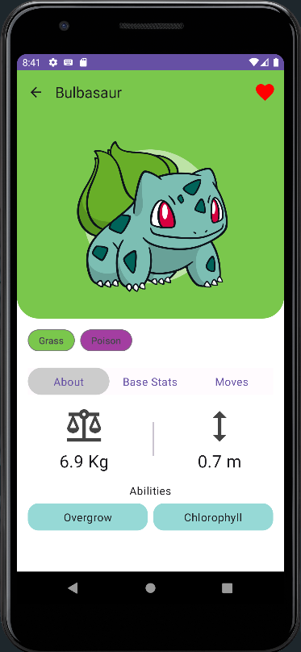
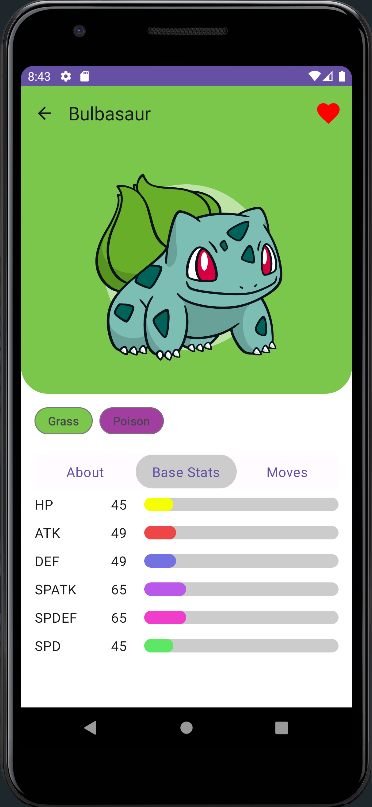
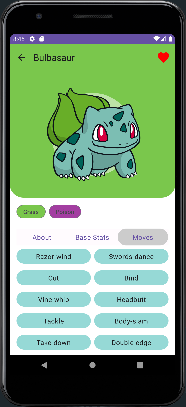

# Project Title

Pokedex Jetpack Compose

## Introduction

A Pokedex app using ViewModel, Room, DataStore, Retrofit and Navigation

## Build with

- [Jetpack Compose](https://developer.android.com/jetpack/compose)
- [Kotlin](https://kotlinlang.org/)
- [Navigation](https://developer.android.com/guide/navigation)
- [Room](https://developer.android.com/training/data-storage/room)
- [Coroutines](https://kotlinlang.org/docs/coroutines-overview.html)
- [Gradle Kotlin DSL](https://docs.gradle.org/current/userguide/kotlin_dsl.html)
- [Retrofit](https://square.github.io/retrofit/)
- [PokeAPI]

## Screenshots

  
  
  

  
  
  

- [x] Home
- [x] Pokedex
- [x] Pokedex - Search
- [x] Pokemon Info
- [x] Pokemon Info - About
- [x] Pokemon Info - Base Stats
- [x] Pokemon Info - Moves
- [x] Favorite Pokemon
